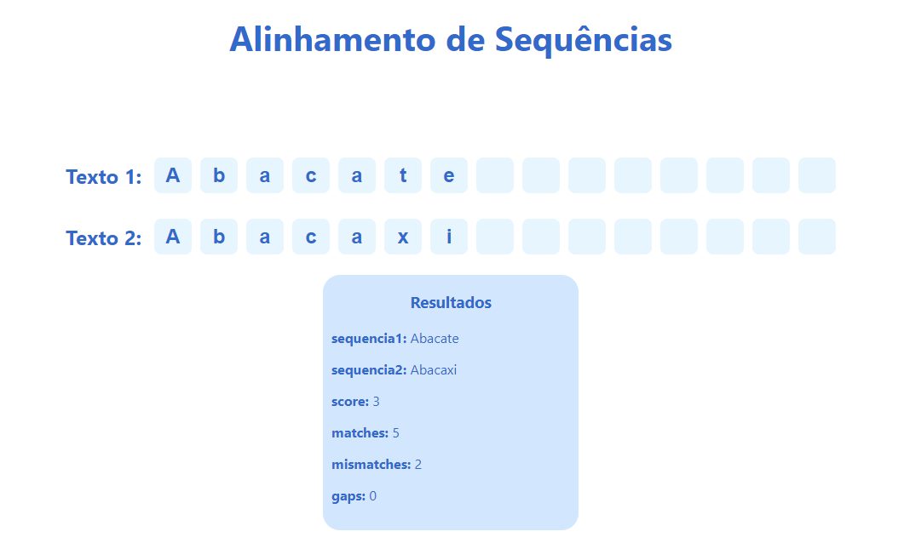
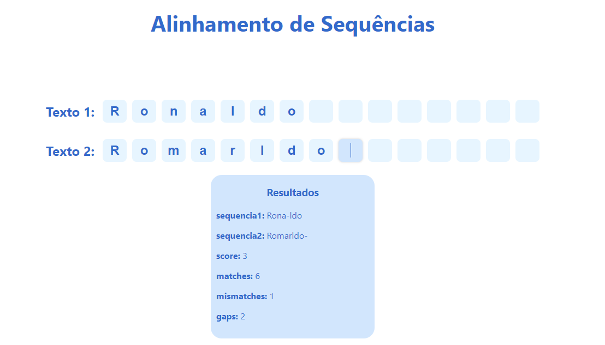
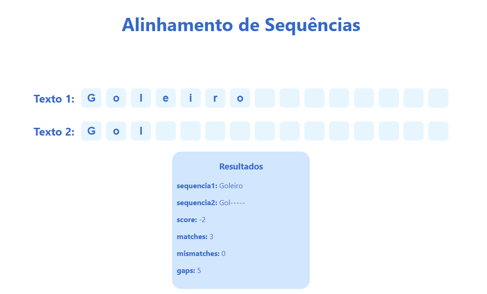

# Alinhamento de Sequências

**Número da Lista**: 11
**Conteúdo da Disciplina**: Programação Dinâmica

## Alunos
|Matrícula | Aluno |
| -- | -- |
| 20/0026488  |  Rafael de Medeiros Nobre |

## Sobre 
O projeto a seguir é uma interface interativa que demonstra o algoritmo de alinhamento de sequências. Ela recebe dois textos de input e calcula o número de matches, mismatches e gaps, utilizando programação dinâmica.

## Screenshots







## Apresentação

A apresentação pode ser encontrada no arquivo assets/apresentacao.mp4

## Instalação 
**Linguagem**: Javascript
**Framework**: React.js<br>

Para executar o projeto, é necessário ter o Node.js a partir da versão 16.0 instalado na máquina. clone o repositório e execute os passos:

**Passo 1**
```
cd alinhamento_sequencias
```

**Passo 2**
```
npm install
```

## Uso 

O projeto pode ser acessado pelo [LINK](https://projeto-de-algoritmos.github.io/PD_AlinhamentoSequencias/), ou pode ser executado localmente seguindo o passo a passo abaixo:

Para executar o projeto, execute o código:

```
npm start
```

E abra o endereço http://localhost:3000